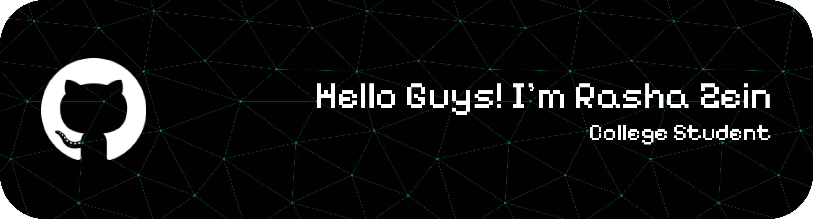

  
  
  
  

#### 🧑🏻‍💻 Skills & 🤖 Artificial Intelligence

            

#### 💻 The Terminal I Use

 

#### 👀 The OS I use

  

#### 👨‍💻 Office software I can use

      

#### 🤳🏻 Connect With Me 

#### 🎮 Chill Area

<picture>
  <source media="(prefers-color-scheme: dark)" srcset="https://raw.githubusercontent.com/rashazein11/rashazein11/output/galaga-contribution-graph-dark.svg">
  
</picture>